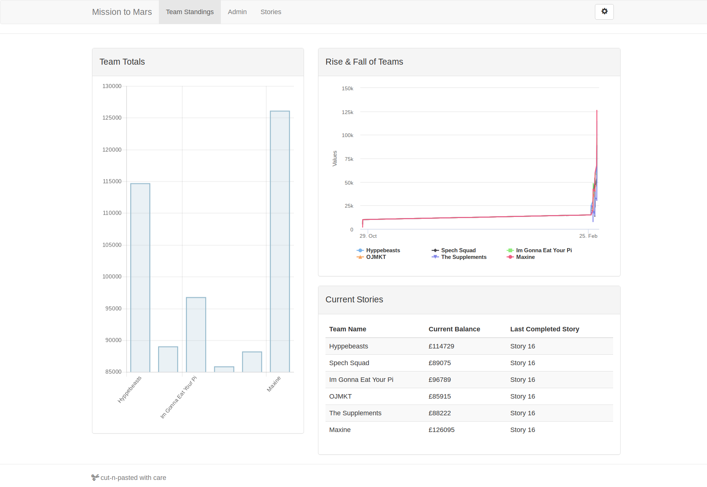

# Mission to Mars: Cornwall College, Feb 2019
Code created by the six teams at the Cornwall College Mission to Mars work
experience program, hosted at the college campus in St. Austell. Students were
given the support of a team of mentors from local education and businesses and
tasked to complete the provided manoeuvrability challenges.

## Results
The challenges come with a Core Coin reward, with the prizes being totted up via
the teams dashboard.

The results were:

1. Maxine                  - $126,095
2. Hypebeasts              - $114,729
3. I'm gonna eat your PI   - $96,032
4. Spech Squad             - $89,075
5. The Supplements         - $88,222
6. OJMKT                   - $85,915

## Usage Instructions
Clone the project locally and check out the various .ino files.
